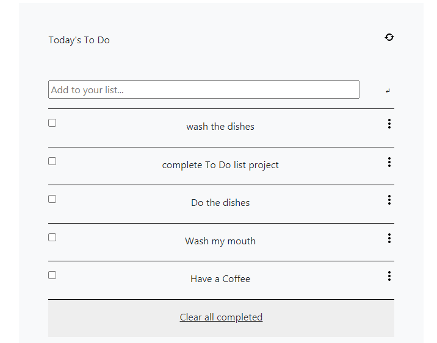

# To do List

> One paragraph statement about the project.



Additional description about the project and its features.

## Built With

- JavaScript
    - Webpack
- HTML5
- CSS3
    - Vanilla
    - Bootstrap

## Getting Started

To get a local copy up and running follow these simple example steps.

### Prerequisites

- NodeJS
- VSCode

### Setup
- Clone this repository anywhere you want with:

```git clone https://github.com/JuliCarracedo/to-do-list.git```

- Move to the cloned folder:

```git cd to-do-list```

### Install

- Run the following code lines one by one on your console, opened from this file:

``` npm init -y```

```npm install webpack webpack-cli --save-dev```

```npm install --save-dev html-webpack-plugin```

```npm install --save-dev webpack-dev-server```

- Run the following to build the app.

```npm run build```

- Run the following to deploy it onto a local server.

```npm start```
### Usage

 For the current version, you can check your already done tasks, and their text gets edited with a line-through. Also you can add items to the list and the 'clear all completed' button disposes all completed tasks.

## Author

👤 **Julian Carracedo**

- GitHub: [@JuliCarracedo](https://github.com/JuliCarracedo)
- Twitter: [@CarracedoTrigo](https://twitter.com/CarracedoTrigo)
- LinkedIn: [Julian Carracedo](https://linkedin.com/in/julian-carracedo)

## 🤝 Contributing

Contributions, issues, and feature requests are welcome!

## Show your support

Give a ⭐️ if you like this project!

## 📝 License

This project is [MIT](./MIT.md) licensed.